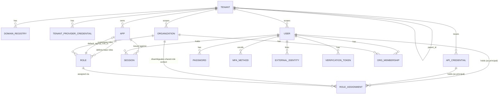

# Data Model

Companion to [TECHNICAL_DESIGN.md](./TECHNICAL_DESIGN.md) §3 (whose entity table is
explicitly "a baseline, not a final schema" — this document is that schema) and
[AUTHORIZATION_MODEL.md](./AUTHORIZATION_MODEL.md) (scope semantics referenced throughout).
Formalizes every entity discussed across the wiki into real tables: columns, types, keys,
and relationships.

A few entities below (marked **inferred**) weren't explicitly decided in prior discussion —
they're reasonable extrapolations needed to make already-agreed behavior actually
persistable (e.g. social login needs *somewhere* to store the provider identity). Flag if
any should be designed differently.

## 0. Conventions

- All tables use a UUID `id` primary key unless noted.
- All tables have `created_at`; mutable tables also have `updated_at`.
- Tenant-scoped tables carry a `tenant_id` column per the shared-table multi-tenancy model
  (TECHNICAL_DESIGN §3.1) — omitted from column lists below where obvious from context, but
  present on every table under §2–§7.
- **Soft delete, with actor tracking, is the standard pattern**: every mutable entity table
  gets `created_by`, `updated_by`, `deleted_at`, `deleted_by`. `deleted_at` being non-null is
  what "deleted" means — rows are never hard-deleted through normal application flows.
- **Unique constraints on a soft-deletable column are partial, scoped to
  `WHERE deleted_at IS NULL`** — never a plain, unconditional unique constraint. A
  soft-deleted row must free its unique value up for reuse (e.g. `domain_registries.domain`,
  `tenant_provider_credentials`' `(tenant_id, provider_type)` pair); since soft delete never
  hard-deletes the old row (above), an unconditional constraint would permanently block
  reusing any value that was ever removed. Applies to every future unique constraint on a
  soft-deletable table, not just the two named here.
- **A "principal" is a `user` or an `api_credential`, undifferentiated.** Resources can be
  created/modified/deleted via API credentials (MCP/automation) exactly as they can by a
  logged-in user — both are just "whoever requested this," and nothing in the schema needs
  to tell them apart. So `created_by`/`updated_by`/`deleted_by` (and `role_assignments`'
  actor-facing column, and `audit_logs`') store a single **principal id**: a `uuid` that
  points at either `users.id` or `api_credentials.id`, with no database-level FK constraint
  (Postgres can't FK one column to two tables) — resolved at the application layer instead.
  Null means system-generated (e.g. the auto-provisioned default system app, an
  auto-assigned Owner role), not caused by a specific actor.
- **Exceptions**, where the pattern doesn't fit and isn't applied:
  - `audit_logs` is append-only by design (TECHNICAL_DESIGN §9) — no `updated_by`/`deleted_at`/
    `deleted_by`. Its single `actor_id` (principal, per above) already serves the "who"
    question for that one row.
  - `verification_tokens` has `used_at`/`expires_at` as its own closed-lifecycle markers — no
    separate `deleted_at`.
  - `sessions` and `api_credentials` use the exact same `deleted_at`/`deleted_by` pair as
    every other table (no `revoked_at`/`revoked_by` special-casing) — "revocation" for these
    two is just what a delete means in context.
- Encrypted columns (per TECHNICAL_DESIGN §8's application-level encryption port) are noted
  explicitly.
- **Permission/scope strings are never schema-enforced.** `{module}:{action}@{scope}`
  (AUTHORIZATION_MODEL §1–§3) is an internal parsing convention this codebase follows — not
  a structure the database validates or constrains. Nowhere in this schema is a permission
  decomposed into separate `module`/`action`/`scope` columns, and no scope value is
  constrained by a database enum. A permission is always stored as one opaque string; the
  application layer alone knows how to parse it, and could parse a different pattern
  entirely without a schema change.

## 1. Tenancy & Configuration

### `tenants`
Adjacency-list hierarchy (TECHNICAL_DESIGN §3.2).

Branding and auth-policy settings are folded directly into `tenants` — both are strictly 1:1
relationships, so splitting them into their own tables bought organizational tidiness but
no normalization benefit. Token TTLs are the exception: those live on `apps` (§2), not here
— see that section for why.

| Column | Type | Notes |
|---|---|---|
| `id` | uuid, PK | |
| `parent_id` | uuid, FK → tenants.id, nullable | null for the root tenant |
| `ancestors` | uuid[], GIN-indexed | this row's full chain of ancestor ids, empty for the root tenant — see below |
| `name` | text | |
| `logo_url` | text | tenant's own logo, shown on the login screen (TECHNICAL_DESIGN §1) |
| `brand_image_url` | text, nullable | used only by the Split layout |
| `login_layout` | enum(`centered`, `split`) | admin-chosen, not inferred from image |
| `mfa_required` | boolean | PRD §5.4 |
| `enabled_login_methods` | jsonb/array | which of email+password, email+OTP, phone+OTP, WebAuthn, Google, Apple are on (PRD §5.1) |
| `audit_retention_days` | int | default 90 (TECHNICAL_DESIGN §9) |
| `created_at`, `updated_at` | timestamp | |
| `created_by`, `updated_by` | uuid, principal (§0), nullable | null for the root tenant (system-bootstrapped) |
| `deleted_at`, `deleted_by` | timestamp / uuid, nullable | |

`ancestors` is what makes descendant-scope authorization (AUTHORIZATION_MODEL.md §4) a
single containment check instead of a recursive tree walk: computed at creation time as the
parent's own `ancestors` plus the parent's `id` — no recursive query needed, since the
parent row already carries its own full chain. When a tenant is soft-deleted, its `id` is
stripped out of every other row's `ancestors` array in the same transaction (not a cascade
delete — a surviving descendant keeps its remaining ancestors and its own `parent_id` may
end up pointing at a soft-deleted row, which is an accepted consequence, not a bug).

### `domain_registries`
Origin/domain → tenant resolution (TECHNICAL_DESIGN §3.3). Stays a separate table — a
genuine one-to-many relationship (a tenant can register multiple domains), plus it needs a
uniqueness constraint on `domain` *across all tenants* and a tight index for the
highest-traffic lookup path in the system.

| Column | Type | Notes |
|---|---|---|
| `id` | uuid, PK | |
| `tenant_id` | uuid, FK → tenants.id | |
| `domain` | text, unique | the registered origin |
| `created_at` | timestamp | |
| `created_by` | uuid, principal (§0), nullable | |
| `deleted_at`, `deleted_by` | timestamp / uuid, nullable | |

### `tenant_provider_credentials` *(inferred grouping)*
Per-tenant pluggable provider config — social login apps (PRD §5.1) and OTP delivery
(TECHNICAL_DESIGN §5). One row per provider per tenant.

| Column | Type | Notes |
|---|---|---|
| `id` | uuid, PK | |
| `tenant_id` | uuid, FK → tenants.id | |
| `provider_type` | enum(`google`, `apple`, `otp_email`, `otp_sms`) | |
| `config_encrypted` | bytea/jsonb | client ID/secret or provider API key, application-level encrypted (TECHNICAL_DESIGN §8) |
| `created_at`, `updated_at` | timestamp | |
| `created_by`, `updated_by` | uuid, principal (§0), nullable | |
| `deleted_at`, `deleted_by` | timestamp / uuid, nullable | |

## 2. Apps & Sessions

### `apps`
OAuth2/OIDC client under a tenant. Includes the default system app (TECHNICAL_DESIGN §3.5).

Token lifetimes live here, not on `tenants` — they're configured per app, same as signing
config. A tenant-level login session is issued against the tenant's default system app
(TECHNICAL_DESIGN §3.5), so it simply inherits *that app's* TTLs; there's no separate
tenant-wide TTL setting.

| Column | Type | Notes |
|---|---|---|
| `id` | uuid, PK | |
| `tenant_id` | uuid, FK → tenants.id | |
| `name` | text | |
| `client_id` | text, unique | |
| `client_secret_hash` | text, nullable | null if using key-pair/JWKS instead of a shared secret |
| `redirect_uris` | jsonb/array | |
| `logo_url` | text, nullable | app's own logo, shown on the consent screen — distinct from tenant branding |
| `is_system` | boolean, default false | true only for the auto-provisioned default system app; non-deletable (TECHNICAL_DESIGN §3.5) |
| `supports_organizations` | boolean | individual-signup vs. org-enabled app (PRD §6/§7.2) |
| `default_signup_role_id` | uuid, FK → roles.id, nullable | role auto-assigned to a new user of this app — applies uniformly whether they arrived via individual signup or organization signup (single field, not segregated by signup type); superseded by more specific mechanisms where they apply — the auto-assigned Owner role on org creation (USER_JOURNEYS_ORGANIZATIONS.md §1), or an inviter's explicitly chosen role on invite acceptance (§2) |
| `signing_algorithm` | enum(`RS256`,`RS512`,`ES256`,...) | per-app (TECHNICAL_DESIGN §4) |
| `signing_key_config_encrypted` | bytea/jsonb | shared secret, key pair, or JWKS reference — application-level encrypted |
| `access_token_ttl_seconds` | int | default ~900 (TECHNICAL_DESIGN §4) |
| `id_token_ttl_seconds` | int | |
| `refresh_token_ttl_seconds` | int | default ~2,592,000 (30 days) |
| `created_at`, `updated_at` | timestamp | |
| `created_by`, `updated_by` | uuid, principal (§0), nullable | null for the auto-provisioned default system app |
| `deleted_at`, `deleted_by` | timestamp / uuid, nullable | the default system app is non-deletable (TECHNICAL_DESIGN §3.5) — enforced at the application layer, not by omitting these columns |

### `sessions`
Postgres source of truth (TECHNICAL_DESIGN §4). Revocation (admin-triggered, self-service,
or the password-change cascade) is just what "deleted" means for a session — uses the
standard `deleted_at`/`deleted_by` pair, no special-casing. No `created_by`, since a
session's creator is always its own `user_id` — tracking that separately would be redundant.

| Column | Type | Notes |
|---|---|---|
| `id` | uuid, PK | |
| `user_id` | uuid, FK → users.id | |
| `app_id` | uuid, FK → apps.id | points at the default system app for tenant-level sessions (TECHNICAL_DESIGN §3.5), or a real app for app-scoped sessions |
| `aud` | text | tenant id or app client_id — mirrors the token's `aud` claim |
| `refresh_token_hash` | text | |
| `device_label` | text, nullable | shown in the "active sessions" self-service list (PRD §9.4) |
| `ip_address` | inet, nullable | |
| `created_at`, `last_active_at` | timestamp | |
| `expires_at` | timestamp | |
| `deleted_at` | timestamp, nullable | set on admin revocation, self-service revocation, or password-change cascade (PRD §9.3) |
| `deleted_by` | uuid, principal (§0), nullable | the session's own user for self-service revoke, an admin (or an API credential acting on the tenant's behalf) for forced revocation, null if triggered by the password-change cascade itself (system-triggered) |

## 3. Identity

### `users`
| Column | Type | Notes |
|---|---|---|
| `id` | uuid, PK | |
| `tenant_id` | uuid, FK → tenants.id | identity is isolated per tenant (PRD §4.2) |
| `status` | enum(`draft`, `active`) | `draft` = invited but not yet activated (org-invite journey) |
| `draft_expires_at` | timestamp, nullable | cleanup deadline for unactivated drafts |
| `display_name` | text, nullable | |
| `profile_picture_url` | text, nullable | |
| `email` | text, nullable | active, verified email |
| `email_verified` | boolean | |
| `pending_email` | text, nullable | awaiting verification (PRD §9.1) |
| `phone` | text, nullable | |
| `phone_verified` | boolean | |
| `pending_phone` | text, nullable | |
| `created_at`, `updated_at` | timestamp | |
| `created_by` | uuid, principal (§0), nullable | the inviter for a draft account created via org invite (USER_JOURNEYS_ORGANIZATIONS.md §2, could be a user or an API credential automating invites); null for self-signup |
| `updated_by` | uuid, principal (§0), nullable | almost always the user themself; nullable for system-triggered updates |
| `deleted_at`, `deleted_by` | timestamp / uuid, nullable | account deletion (self-service deletion is out of scope for v1, PRD §12 — this supports admin-initiated removal) |

### `passwords`
**Not** 1:1 with a user — a user has *many* rows in `passwords` over time, of which exactly
one has `deleted_at IS NULL` (their current/active password); a partial unique index enforces
that: `UNIQUE (user_id) WHERE deleted_at IS NULL`. Changing a password doesn't update a row
in place, it soft-deletes the current one (`deleted_at`/`deleted_by` set) and inserts a new
active row. This is what backs the "last 4 passwords" reuse check (PRD §9.3) — no separate
history table needed; the check queries this same table's last 4 rows (by `created_at`,
across both active and soft-deleted) for the user. Unlike other soft-deleted tables, these
rows are kept indefinitely rather than pruned — consistent with "soft delete = never hard
delete" (§0), superseding the earlier pruning-based design.

Not every user has rows here at all — only those who've used the email+password method
(social-login and passwordless-method users have none, per PRD §9.3).

| Column | Type | Notes |
|---|---|---|
| `id` | uuid, PK | |
| `user_id` | uuid, FK → users.id | |
| `password_hash` | text | bcrypt (TECHNICAL_DESIGN §5) |
| `created_at` | timestamp | when this password became active |
| `deleted_at`, `deleted_by` | timestamp / uuid, nullable | set when superseded by a new password; `deleted_by` is almost always the user themself, per PRD §9.3's current-password requirement |

### `mfa_methods`
`deleted_at` here is exactly the self-service "remove a method" action
(USER_JOURNEYS_ACCOUNT_MANAGEMENT.md §2), which requires step-up re-authentication — so
`deleted_by` is meaningful (almost always the user themself, confirming their own removal).

| Column | Type | Notes |
|---|---|---|
| `id` | uuid, PK | |
| `user_id` | uuid, FK → users.id | |
| `type` | enum(`totp`, `webauthn`) | |
| `secret_encrypted` | bytea, nullable | TOTP secret, instance-wide key (TECHNICAL_DESIGN §5) |
| `credential_id`, `public_key` | text/bytea, nullable | WebAuthn only |
| `created_at`, `last_used_at` | timestamp | |
| `created_by` | uuid, principal (§0), nullable | the user themself for self-enrollment |
| `deleted_at`, `deleted_by` | timestamp / uuid, nullable | |

### `external_identities` *(inferred)*
Not explicitly modeled before — needed to link a `user` to a Google/Apple account.

| Column | Type | Notes |
|---|---|---|
| `id` | uuid, PK | |
| `user_id` | uuid, FK → users.id | |
| `provider` | enum(`google`, `apple`) | |
| `provider_subject_id` | text | the provider's stable user identifier |
| `created_at` | timestamp | |
| `deleted_at`, `deleted_by` | timestamp / uuid, nullable | unlinking a social account |

Unique constraint on (`provider`, `provider_subject_id`) — and this is the join point for
account auto-linking by verified email (PRD §5.3): linking checks `users.email` first, not
this table directly.

### `verification_tokens` *(inferred)*
Generic single-use token backing every "click a link/enter a code to confirm" flow: email
change, phone change, and org-invite activation (USER_JOURNEYS_ORGANIZATIONS.md §2). OTP
login codes are a separate, short-lived mechanism (deferred per PRD §5.5) — not this table.
`used_at`/`expires_at` already cover its lifecycle (§0 exceptions) — no `deleted_at`.

| Column | Type | Notes |
|---|---|---|
| `id` | uuid, PK | |
| `user_id` | uuid, FK → users.id | |
| `type` | enum(`email_change`, `phone_change`, `org_invite`) | |
| `target_value` | text, nullable | the pending new email/phone being verified |
| `token_hash` | text | never store the raw token |
| `expires_at` | timestamp | |
| `used_at` | timestamp, nullable | |
| `created_at` | timestamp | |
| `created_by` | uuid, principal (§0), nullable | the inviter, for `org_invite` tokens; null (self) otherwise |

## 4. Organizations

### `organizations`
| Column | Type | Notes |
|---|---|---|
| `id` | uuid, PK | |
| `tenant_id` | uuid, FK → tenants.id | shared across all apps in the tenant (PRD §6) |
| `name` | text | |
| `logo_url` | text, nullable | the organization's own logo, distinct from tenant/app branding |
| `created_at`, `updated_at` | timestamp | |
| `created_by` | uuid, principal (§0) | the creator — who also gets the auto-assigned Owner role (§1 of USER_JOURNEYS_ORGANIZATIONS.md) |
| `updated_by` | uuid, principal (§0), nullable | |
| `deleted_at`, `deleted_by` | timestamp / uuid, nullable | |

### `org_memberships`
`deleted_at` here is the "leave an organization" / "remove a member" action
(USER_JOURNEYS_ORGANIZATIONS.md §4), permission-gated per `@own` or a broader scope.

| Column | Type | Notes |
|---|---|---|
| `id` | uuid, PK | |
| `org_id` | uuid, FK → organizations.id | |
| `user_id` | uuid, FK → users.id | |
| `status` | enum(`pending`, `active`) | `pending` until the invited user activates (USER_JOURNEYS_ORGANIZATIONS.md §2) |
| `created_at`, `updated_at` | timestamp | `updated_at` covers the pending → active transition |
| `created_by` | uuid, principal (§0) | the inviter (or the org creator, for their own initial membership) |
| `deleted_at`, `deleted_by` | timestamp / uuid, nullable | `deleted_by` = the member themself (self-service leave) or whoever removed them |

Unique constraint on (`org_id`, `user_id`).

## 5. Authorization

### `roles`
Permissions and policies are **embedded directly on the role** as arrays, not normalized
into child tables. Reasoning: editing a role's permission/policy set is a frequent event
(one row UPDATE, no child-table inserts/deletes to coordinate), while the runtime
authorization check never touches this table anyway — it reads from the precomputed cache
(TECHNICAL_DESIGN §6). The real win is avoiding a JOIN in the two places that *do* hit
Postgres directly: rebuilding that cache whenever a role changes, and the admin UI listing
a role's permissions.

Trade-off accepted: this drops the per-permission `created_by`/`deleted_at`/`deleted_by`
granularity the rest of this document uses (§0) — there's no child row to soft-delete
per permission anymore, just the array contents. If "who added this specific permission,
when" is ever needed, it's reconstructed from `audit_logs` (PRD §11), not stored on the row.
Global changes to a permission/policy's own definition (rare, per this trade-off) require
scanning/updating every role row that references it, instead of one child-table row.

Both `permissions` and `policies` are **plain arrays** — bare strings / bare JSON objects,
no embedded metadata — kept simple rather than adding structure to preserve provenance.
A GIN index on both columns is recommended for containment queries (e.g. "which roles grant
`billing:*@tenant`").

| Column | Type | Notes |
|---|---|---|
| `id` | uuid, PK | |
| `tenant_id` | uuid, FK → tenants.id | |
| `app_id` | uuid, FK → apps.id, nullable | null = org-management system role (e.g. Owner) not tied to a specific app's business catalog; set = that app's business role (PRD §7.2) |
| `org_id` | uuid, FK → organizations.id, nullable | null = base role definition (app-owner-defined); set = an org's customized/extended variant |
| `name` | text | |
| `is_system` | boolean | true for auto-provisioned roles (org Owner, default individual-app "User" role) |
| `permissions` | text[] | opaque strings, e.g. `["users:read@org", "roles:*@org"]` under the current internal convention (AUTHORIZATION_MODEL §5) — the schema doesn't know or enforce that shape (§0) |
| `policies` | jsonb | array of opaque policy objects (PRD §7.1) — Porichoy never interprets contents |
| `created_at`, `updated_at` | timestamp | `updated_at` covers permission/policy array edits too, not just `name`/etc. |
| `created_by`, `updated_by` | uuid, principal (§0), nullable | null for system-provisioned roles (Owner, default "User") |
| `deleted_at`, `deleted_by` | timestamp / uuid, nullable | |

### `role_assignments`
Binds `{principal, role}` — **scope is not stored here**. Scope lives on each permission
string within the role itself (`roles.permissions`, e.g. `users:read@org`) — a role
assignment just grants its holder everything that role carries; AUTHORIZATION_MODEL's scope
resolution operates on those embedded permission scopes, not on anything recorded
per-assignment. The holder is a **principal** (§0) — a `user` or an `api_credential` — since
API credentials need real granted permissions to do anything, the same as a user does.

The one exception is `org_id`, kept narrowly typed rather than a generic scope pair: it
disambiguates which org a **shared/base** role (`roles.org_id` is null — reused across every
org using that app) applies to for a given holder, since the same principal can hold that
same base role in one org and a different role (or none) in another. For a role that's
already org-specific (`roles.org_id` set) or has neither `app_id` nor `org_id` (app-scoped
individual-sign-up roles, tenant/root admin roles), `org_id` here is null — the role itself
already disambiguates, nothing extra needed.

`created_by` is who exercised the `roles:assign@{scope}` permission (PRD §7.2/§7.1) to grant
it; `deleted_at`/`deleted_by` covers un-assigning a role.

| Column | Type | Notes |
|---|---|---|
| `id` | uuid, PK | |
| `principal_id` | uuid, principal (§0) | the holder of this role — a user or an api_credential |
| `role_id` | uuid, FK → roles.id | |
| `org_id` | uuid, FK → organizations.id, nullable | only set when assigning a shared/base role in the context of one specific org; null otherwise |
| `created_at` | timestamp | |
| `created_by` | uuid, principal (§0), nullable | null for system auto-assignment (e.g. Owner role on org creation) |
| `deleted_at`, `deleted_by` | timestamp / uuid, nullable | |

### `api_credentials`
Automation/MCP access (TECHNICAL_DESIGN §7 — separate from end-user session tokens). Uses
the standard `deleted_at`/`deleted_by` pair, same as `sessions`.

| Column | Type | Notes |
|---|---|---|
| `id` | uuid, PK | |
| `tenant_id` | uuid, FK → tenants.id | |
| `name` | text | |
| `key_hash` | text | |
| `created_by` | uuid, principal (§0) | who provisioned this credential — a user (via the admin UI) or, in principle, another API credential |
| `created_at`, `last_used_at` | timestamp | |
| `deleted_at`, `deleted_by` | timestamp / uuid, nullable | |

Permissions for an API credential are granted the same way as for a user — via
`role_assignments.principal_id` (§5), decided rather than inferred now.

## 6. Operations

### `audit_logs`
Every API call (PRD §11).

| Column | Type | Notes |
|---|---|---|
| `id` | uuid, PK | |
| `tenant_id` | uuid, FK → tenants.id | |
| `actor_id` | uuid, principal (§0), nullable | who made the call — a user or an api_credential, undifferentiated; null for unauthenticated attempts (e.g. a failed login) |
| `module`, `action`, `scope` | text | mirrors the route/permission that was exercised |
| `resource_id` | text, nullable | |
| `status_code` | int | |
| `metadata` | jsonb, nullable | |
| `created_at` | timestamp | written async/buffered (TECHNICAL_DESIGN §9) |

## 7. Entity Relationship Diagram

## 8. Open Items

1. **`verification_tokens` retention** — how long expired/used tokens are kept before
   cleanup, separate from the draft-account expiry window itself (USER_JOURNEYS_ORGANIZATIONS.md §2).
