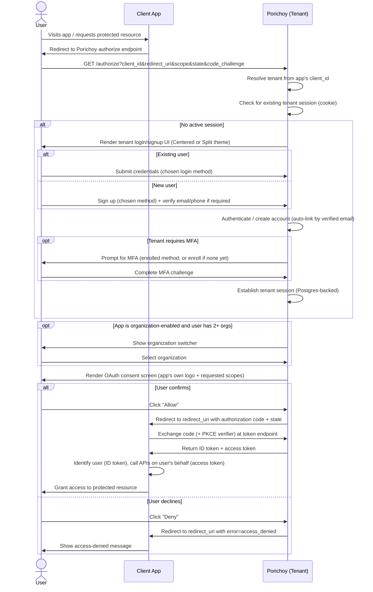

# User Journeys: Authentication Flow

Companion to [PRD.md](../PRD.md) and [TECHNICAL_DESIGN.md](../TECHNICAL_DESIGN.md). Describes
the end-to-end journey of a user authenticating into a client app via Porichoy, and the
branches that hang off the core flow.

## 1. Core Flow (Happy Path)

1. **User visits an App** that requires the user to be signed in to access a protected
   resource.
2. **App redirects the user's browser** to its tenant's OAuth authorization endpoint
   (Authorization Code + PKCE per TECHNICAL_DESIGN §4), passing `client_id`, `redirect_uri`,
   `scope`, `state`, and `code_challenge`.
3. **Porichoy resolves the tenant** the app belongs to and checks for an existing tenant
   session (session cookie, validated against the Postgres-backed session store —
   TECHNICAL_DESIGN §4).
   - **If the user already has an active tenant session**: skip straight to the consent
     screen (step 5).
   - **If not**: the user is shown the tenant's login/signup UI (§2 below).
4. **User authenticates or signs up** (§2 below), establishing a tenant session — under the
   hood, this issues an ID token + access token pair scoped to the tenant's default system
   app (`aud` = the tenant, TECHNICAL_DESIGN §3.5), not yet the requesting app.
5. **Porichoy renders the OAuth consent screen** — the requesting app's own logo/name
   (per-app branding, TECHNICAL_DESIGN §1) and the scopes being requested.
6. **User clicks "Allow"** to confirm.
7. **Porichoy redirects back to the app's `redirect_uri`** with an authorization code and
   the original `state`.
8. **App exchanges the code** (plus its PKCE verifier) at the token endpoint.
9. **Porichoy returns a second, app-scoped ID token and access token** (`aud` = this
   app's client_id, TECHNICAL_DESIGN §3.5/§4) — distinct from the tenant-scoped pair from
   step 4. The app uses the ID token to identify the user locally, and the access token to
   call Porichoy APIs (e.g. the runtime permissions API) on the user's behalf.
10. **App grants the user access** to the originally requested resource.

## 2. Branch: Login or Signup

Shown when step 3 finds no active tenant session. Rendered using the tenant's configured
login UI variant — Centered or Split, with the tenant's own logo/brand image
(TECHNICAL_DESIGN §1) — and whichever login methods that tenant has enabled
(email+password, email+OTP, phone+OTP, WebAuthn, Google, Apple — PRD §5.1).

- **Existing user**: submits credentials via their chosen enabled method.
- **New user**: signs up via a chosen enabled method. If the method requires it, email or
  phone verification happens before the account is considered active. Basic profile info
  (at minimum, whatever the method requires) is captured at this point; further profile
  fields (PRD §9.1) can be filled in later via self-service account management.
- Accounts are auto-linked by verified email across methods (PRD §5.3) — so if a returning
  user signs up again via a different method using the same verified email, it resolves to
  their existing account rather than creating a duplicate.

Either path ends with a tenant session established, then proceeds to §3 (if MFA is
required) or directly to the consent screen (step 5 of the core flow).

## 3. Branch: Forced MFA Challenge

If the tenant has MFA enabled as a required policy (PRD §5.4), this happens immediately
after primary authentication/signup succeeds, before the consent screen:

- **User has an enrolled MFA method**: prompted to complete the challenge (TOTP code or
  WebAuthn) for one of their enrolled methods.
- **User has no MFA method enrolled yet** (e.g. just signed up): prompted to enroll one
  before continuing — since the tenant requires MFA, the user cannot proceed without at
  least one active method (PRD §9.2).

On success, proceeds to the consent screen (or organization selection, §4, if applicable).

## 4. Branch: Organization Selection

Applies only to organization-enabled apps (PRD §6). If the authenticated user belongs to
more than one organization, they're shown the organization switcher to pick which
organization context applies for this session with the app, before the consent screen is
rendered — since roles for org-enabled apps are organization-scoped (PRD §7.2), the app
needs to know which org's permissions apply.

If the user belongs to exactly one organization, this step is skipped (auto-selected). If
the user belongs to none yet, they can self-service create one (PRD §6) at this point.

See [USER_JOURNEYS_ORGANIZATIONS.md](./USER_JOURNEYS_ORGANIZATIONS.md) for organization
creation, member invites, and how switching organizations later (re-authorization) works in
detail.

## 5. Branch: User Declines Consent

At the consent screen, the user can click "Deny" instead of "Allow":

- Porichoy redirects back to the app's `redirect_uri` with an error parameter (e.g.
  `error=access_denied`) instead of an authorization code.
- The app is responsible for handling this gracefully (e.g. showing a message explaining
  access wasn't granted) — no tokens are issued.

## 6. Branch: Session Expires Mid-Flow

If a tenant session cookie expires or is revoked (e.g. an admin force-revoked it, PRD §9.4)
between steps 3 and 6 of the core flow, Porichoy detects the invalid session at the
consent step and routes the user back into the login/signup branch (§2) to re-authenticate,
rather than completing the flow with a stale session.

## 7. Sequence Diagram

