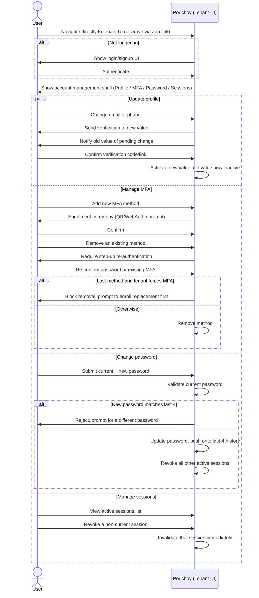

# User Journeys: Self-Service Account Management

Companion to [PRD.md](../PRD.md) §9, [TECHNICAL_DESIGN.md](../TECHNICAL_DESIGN.md), and
[USER_JOURNEYS.md](./USER_JOURNEYS.md) (the OAuth login/consent journey). Covers the
journeys a user takes to manage their own account within a tenant, independent of any
specific app.

## 0. Entry Point

A user can reach account management two ways:

- **Directly**: navigating straight to the tenant's Porichoy URL and logging in if not
  already authenticated. This authenticates the user and issues an ID token + access token
  pair directly — scoped to the tenant's auto-provisioned **default system app**
  (TECHNICAL_DESIGN §3.5), with `aud` = the tenant rather than a specific app's client_id.
  There's no external `redirect_uri` or third party involved, so no Authorization
  Code/PKCE redirect dance and no consent screen — the token pair is issued straight away
  on successful authentication. This token pair is what authorizes every self-service API
  call described below.
- **Via an app**: an app links back to the tenant's account management UI (e.g. a "Manage
  your account" link), reusing the existing tenant session (i.e. the same default-system-app
  token pair, established the first time the user authenticated).

Because this is part of the same unified UI (TECHNICAL_DESIGN §1), account management,
login/signup, the org switcher, and permission-gated admin all live in one shell — a
logged-in user simply sees the "Account" section alongside whatever else their permissions
allow.

## 1. Journey: Update Profile (PRD §9.1)

- **Name / profile picture (DP)**: edited and saved immediately — no verification step.
- **Email address**:
  1. User enters a new email address.
  2. The new address stays *pending* — the account's active login email is unchanged.
  3. A verification link/code is sent to the **new** email.
  4. A notification is sent to the **old** email flagging that a change was requested (so
     the legitimate owner is alerted if this wasn't them).
  5. Until the user verifies the new address, they continue to log in with the old one.
  6. Once verified, the new address becomes the account's active email.
- **Phone number**: same pending → verify → notify-old-number → activate pattern as email,
  using OTP verification instead of a link.

## 2. Journey: Manage MFA Methods (PRD §9.2)

- User views a list of their currently enrolled MFA methods (e.g. TOTP, WebAuthn).
- **Enrolling a new method**: standard enrollment ceremony for the chosen method (TOTP: scan
  QR code, confirm with a generated code; WebAuthn: browser credential registration prompt).
  No step-up required to *add* a method.
- **Removing a method**: requires **step-up confirmation** first — the user must
  re-authenticate (re-enter password, or complete a challenge with an existing MFA method)
  before the removal is processed. This prevents an attacker who has only hijacked an active
  session from stripping MFA protection.
  - If the tenant force-enables MFA (PRD §5.4) and this is the user's **last remaining**
    method, removal is blocked outright — the user must enroll a replacement method first.

## 3. Journey: Change Password (PRD §9.3)

- Only shown to users whose account uses the email+password login method — not shown at all
  for accounts authenticated purely via WebAuthn, Google, or Apple.
- User submits their **current password** plus a new password.
- New password is checked against the user's last 4 passwords — a match is rejected with an
  error, and the user must choose a different new password.
- On success:
  - The password is updated (and pushed onto the last-4 history).
  - **All other active sessions are revoked** — every other device/browser is signed out,
    on the assumption that a password change may be in response to a suspected compromise.
    The current session (where the change was made) stays active.

## 4. Journey: View & Revoke Sessions (PRD §9.4)

- User sees a list of their active sessions (device/browser info, last-active time).
- The **current session is shown but not revocable** from this list — it's labeled for
  reference (e.g. "this device") with no logout action attached to it here; ending the
  current session is just the normal logout action, not part of this flow.
- **Other sessions** can each be individually revoked, immediately invalidating that
  session's tokens (TECHNICAL_DESIGN §4 — Postgres-backed session store as source of truth).

## 5. Sequence Diagram

