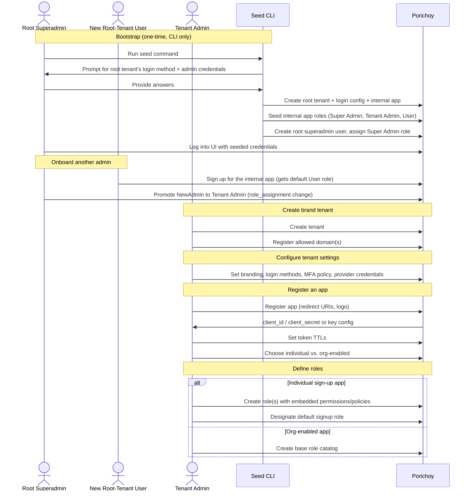

# User Journeys: Admin & Tenant Management

**Status: draft, first pass.** Sketched from a rough outline, not confirmed — expect this to
branch and be revised rather than treated as settled. Open questions hit while drafting are
flagged inline and collected in §8, not silently resolved.

Companion to [PRD.md](../PRD.md) §4 (Tenant & Multi-Tenancy), §7 (Permissions, Roles &
Policies), [TECHNICAL_DESIGN.md](../TECHNICAL_DESIGN.md), [DATA_MODEL.md](../DATA_MODEL.md),
and [AUTHORIZATION_MODEL.md](../AUTHORIZATION_MODEL.md).

## 1. Journey: Bootstrap (Deploy → Root Tenant → Root Superadmin)

On first deployment, there needs to be a root tenant and at least one root superadmin
account before anyone can log into anything — the unified UI itself requires an
authenticated tenant session to render past the login screen, so this first account can't
be created through the normal self-service signup flow.

**Decided: a one-time CLI seed command.** It interactively prompts for the root tenant's
default login configuration — at minimum, which login method to bootstrap with (e.g.
email+password) and the credentials for the initial root superadmin account under that
method. Running it creates:

- the root `tenant` row (`parent_id` null), with enough of its login-method config to
  actually authenticate (§3 covers configuring the rest later, from the UI);
- an **internal app**, owned by the root tenant — this is Porichoy's own admin console,
  and administering the platform itself (creating tenants, etc.) works reflexively through
  the exact same role/permission mechanism as everything else in this system, not a special
  case;
- a seeded set of default roles for that internal app, each with permissions configured to
  match its purpose: **Super Admin** (broad platform-administration permissions), **Tenant
  Admin** (tenant creation/management permissions), and **User** (minimal baseline — this is
  the internal app's `default_signup_role_id`, per §5);
- one `user` row (the initial root superadmin), holding the seeded Super Admin role.

Once the seed completes, the root superadmin logs into the UI with those credentials and
continues everything else — creating brand tenants, configuring their login methods, etc.
(§2 onward) — from there. The CLI is only ever used for this one bootstrap step, not for
ongoing tenant/app management.

## 2. Journey: Create a Brand Tenant

1. Root superadmin logs into the unified UI in the root tenant's context.
2. Creates a new child tenant (`parent_id` = root tenant's id) — name, minimal to start.
3. Registers the tenant's allowed domain(s)/origin(s) in the domain registry
   (TECHNICAL_DESIGN §3.3) — required before the tenant's own login UI can resolve requests
   to it at all.

**Resolved: administration doesn't require a separate account inside the new tenant.**
Creating and managing brand tenants is itself gated by the root tenant's internal app (§1)
— whoever holds the Super Admin or Tenant Admin role there can create/manage tenants,
scoped to the root tenant's own identity, not the new tenant's. This doesn't conflict with
PRD §4.2's identity-isolation rule — that rule is about peer/sibling brand tenants (a Brand
A user and a Brand B user being unrelated), not about root's relationship to its own
children, which is inherently a management relationship, not a peer one.

New administrators are onboarded by signing up for the root tenant's internal app (landing
with the default **User** role, per §5) and then being promoted — an existing Super Admin
or Tenant Admin changes their role assignment to Tenant Admin (or Super Admin), the same
`roles:assign@{scope}`-gated action used everywhere else in this system (PRD §7.2).

> **Working assumption, not confirmed.** Tenant Admin's permissions are modeled as broadly
> root-scoped (can create/manage *any* child tenant), not narrowly tied to one specific
> tenant at assignment time — based on "tenant admins create another tenants" implying a
> general capability, not a per-tenant-scoped one. If a Tenant Admin should instead only
> administer specific tenant(s) they're assigned to, `role_assignment` would need a
> disambiguating reference (the same shape as `org_id`, DATA_MODEL.md §5) for a *target*
> tenant — not built here since it wasn't clearly asked for.

## 3. Journey: Configure Tenant-Level Settings

Done once per tenant, by whoever administers it (per the open question in §2). All of the
following are tenant-scoped, not app-scoped (PRD §5.1/§5.4, TECHNICAL_DESIGN §1):

- **Branding**: logo, brand image, login layout (Centered/Split).
- **Login methods**: which of email+password, email+OTP, phone+OTP, WebAuthn, Google, Apple
  are enabled.
- **MFA policy**: whether MFA is force-enabled for all users of this tenant.
- **Provider credentials**: Google/Apple OAuth app credentials, OTP email/SMS provider keys
  (`tenant_provider_credential`).
- **Audit retention period**.

Apps registered under this tenant (§4) inherit all of this automatically — there's no
per-app override (PRD §5.1).

## 4. Journey: Register an App

1. Tenant admin registers a new app: name, redirect URI(s), logo (shown on the OAuth
   consent screen — distinct from tenant branding).
2. Receives OAuth client credentials — either a generated `client_secret`, or configures a
   bring-your-own key pair/JWKS reference (TECHNICAL_DESIGN §4).
3. Sets this app's token TTLs (access/ID/refresh) — per-app, not tenant-wide (per the
   earlier "token lifetimes live on `app`" decision).
4. Chooses whether the app supports organizations or is individual-sign-up only
   (`app.supports_organizations`, PRD §6/§7.2) — this decision shapes everything in §5.

## 5. Journey: Define Roles (Permissions & Policies Embedded)

Permissions aren't separate objects in this schema — they're opaque strings embedded
directly in `role.permissions` (DATA_MODEL.md `role`). So there's no distinct "create a
permission" step: defining a role *is* the act of choosing which permission strings and/or
policy objects it carries.

- The admin creates one or more roles (e.g. "User", "Admin") and designates **one as the
  default** via `app.default_signup_role_id` (DATA_MODEL.md `app`) — auto-assigned to every
  new user of this app. This one field applies uniformly whether the app is individual
  sign-up or org-enabled — it's not segregated by signup type, consistent with this
  schema's general preference for one field over two. It's superseded where a more specific
  mechanism already applies: the auto-assigned Owner role on org creation
  (USER_JOURNEYS_ORGANIZATIONS.md §1), or an inviter's explicitly chosen role on invite
  acceptance (§2) — the default only fills in when nothing more specific determined a role.

- **Org-enabled apps** additionally need the admin to define the **base role catalog**
  (`role.org_id` null) — the starting set every organization using this app gets. Individual
  orgs later
  customize/extend from this base (PRD §7.2, USER_JOURNEYS_ORGANIZATIONS.md).

## 6. Sequence Diagram

## 7. Not Yet Covered

Deliberately out of this first pass — likely their own journeys later:
- Editing/rotating an app's signing key after creation.
- Deleting or deactivating a tenant or app.
- Demoting/removing an admin (only promotion is covered, §2/§6).

## 8. Open Items

1. ~~**Tenant Admin's scope breadth** (§2)~~ — **Resolved a second time, reverting the
   first resolution.** This doc's original "working assumption" (broadly root-like — a
   tenant admin can reach any descendant tenant, not just their own) was, in fact, correct.
   An earlier pass at this item resolved it as exact-match instead (below `root` scope, a
   caller could only act on their own `act.TenantID`, not even a direct child) — that was
   the wrong call, made when the REST adapter first forced the decision without this
   context. AUTHORIZATION_MODEL.md §4 now defines the `tenant` module's scope→filter mapping
   as descendant-access: below `root` scope, a caller can act on their own `act.TenantID`
   **or any descendant of it**, via a precomputed `ancestors` array (DATA_MODEL.md
   `tenants`) — a sibling or an ancestor is still out of reach, but a grandchild the caller
   didn't directly create is not. Recorded here so the flip-flop is visible rather than
   silently overwritten a second time.
