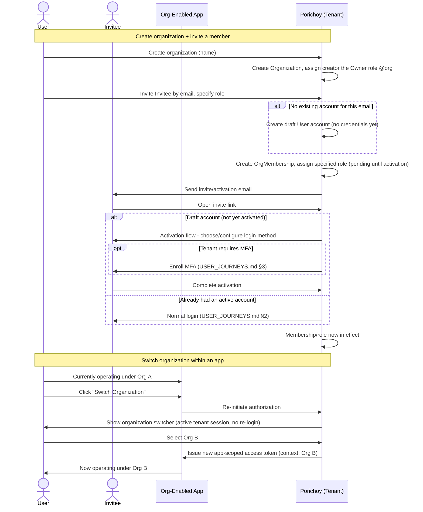

# User Journeys: Organization Creation, Membership & Switching

Companion to [PRD.md](../PRD.md) §6 (Organizations) and §7 (Permissions, Roles & Policies),
[AUTHORIZATION_MODEL.md](../AUTHORIZATION_MODEL.md) (scope model), and
[USER_JOURNEYS.md](./USER_JOURNEYS.md) §4 (Organization Selection branch, which this
document builds directly on for switching).

## 1. Journey: Create an Organization

Two entry points, same underlying creation logic:

- **Proactively**, from the account management area of the unified UI, independent of any
  app.
- **Inline**, during an org-enabled app's authorization flow, when the user belongs to zero
  organizations (USER_JOURNEYS.md §4) — creation happens right there so the flow can
  continue to org selection and consent.

Steps:

1. User provides the organization's name (minimum required field for v1).
2. Porichoy creates the `Organization` record, scoped to the tenant (PRD §6 — shared
   across all apps under that tenant, not tied to whichever app triggered creation if
   created inline).
3. The creator is automatically assigned a system-defined **Owner** role for that org —
   bundling every relevant module's action-wildcard at org scope (e.g. `members:*@org`,
   `roles:*@org`, `orgs:*@org` — see AUTHORIZATION_MODEL.md §5 on action-only wildcards; a
   full `*:*@org` module-wildcard isn't supported, so Owner is assembled from each relevant
   module's wildcard explicitly). This is what lets the creator immediately invite members
   and manage roles without a separate setup step.

> **Side note**: the same pattern applies to individual sign-up apps (no organizations) —
> a new user signing up there is likewise auto-assigned a predefined default role for that
> app (PRD §7.2's app-scoped roles), not just organizations. Worth reflecting in PRD §7.2 /
> TECHNICAL_DESIGN.md if not already explicit — flagging here since it came up in this
> context.

## 2. Journey: Invite & Add a Member

- Someone holding the relevant permission (the Owner, by default, or anyone else granted
  `members:invite@org`) sends an **email invite**, specifying which role the invitee will
  hold once they accept — chosen from that org's role catalog (PRD §7.2: app-owner-defined
  base roles, customizable by the org).
- **At invite time**, Porichoy resolves whether a `User` already exists for that email
  within the tenant:
  - **If not**, a **draft account** is created immediately — a real `User` row (pre-filled
    with the invited email), but with no credentials/login method configured yet. This is
    the same account the person will end up with; it's just created early rather than
    lazily on first signup. It naturally reuses the existing account-auto-linking rule
    (PRD §5.3) — if this email later shows up verified through any signup path, independent
    of this invite, it resolves to this same draft account rather than creating a duplicate.
  - The `OrgMembership` and specified role assignment are created **immediately**, attached
    to this account (draft or existing) — so the org's member list can show the person as
    "invited / pending" right away, not just after they act on the invite.
- **Recipient activates** via the invite link:
  - If they already had an active account, this is just the normal login/signup branch
    (USER_JOURNEYS.md §2) — their existing OrgMembership is already in place.
  - If it's a fresh draft account, they go through an **activation flow**: choose and
    configure a login method from whichever the tenant has enabled (password, WebAuthn,
    Google, etc. — same choice set as a normal signup, just pre-filled with the known
    email), and complete MFA enrollment if the tenant force-enables it (USER_JOURNEYS.md
    §3). Once activation completes, the account is fully active and the pre-created
    membership/role take effect.
- The invited member's role is exactly what the inviter specified — no separate "join with
  no role, get assigned later" state.
- **Draft account expiry**: a draft account that's never activated is cleaned up after a
  configurable period (exact default TBD). Cleanup cascades to any pending
  `OrgMembership`/role assignments created against it — if the person is later invited
  again, they start fresh.

## 3. Journey: Switch Organization (within an app)

Because org context is **bound to the app session/token** (not a dynamic per-call
parameter), switching organizations is a re-authorization, not a silent context flip:

1. User is currently using an org-enabled app under organization A — the app holds an
   access token scoped to that app, issued in the context of org A.
2. User triggers "Switch Organization" from within the app (an app-level UI affordance,
   built using the client SDK).
3. The app re-initiates authorization against Porichoy (same mechanism as
   USER_JOURNEYS.md §4). Since the user still has an active tenant session, there's no
   re-login — they go straight to the organization switcher.
4. User selects organization B (must already be a member — this is not a path to join a new
   org, just to select among existing memberships).
5. Porichoy issues a **new app-scoped access token**, this time in the context of
   org B. Consent is not re-prompted — the user already granted this app access; only the
   org context changed, which isn't a new grant of access to the app itself.
6. The app now operates against organization B's data/permissions. The prior org-A token is
   not proactively revoked — it simply expires naturally per its normal TTL
   (TECHNICAL_DESIGN.md §4).

The org switcher UI itself only appears in this context — the context of authorizing (or
re-authorizing) a specific org-enabled app. It is not a persistent, tenant-wide "current
org" setting, since the tenant session itself is org-agnostic (`aud` = tenant, not any
specific org — TECHNICAL_DESIGN.md §3.5).

## 4. Journey: Leave an Organization

Self-removal is **permission-gated**, not universally available — a member can remove
themselves only if they hold the relevant permission at `own` scope for their own
membership (e.g. `members:remove@own`), consistent with the `own`-scope pattern in
AUTHORIZATION_MODEL.md §4 (the same mechanism that lets a user manage their own profile).
Whether every member holds this by default, or it's something an org's role catalog can
grant/withhold, follows from how that org's roles are defined (PRD §7.2).

> **Open item — needs further discussion**: what happens if the sole remaining Owner tries
> to leave (or is removed)? Whether this is blocked outright (mirroring the "can't remove
> last MFA method" pattern, PRD §9.2) or handled some other way isn't decided yet.

## 5. Sequence Diagram

